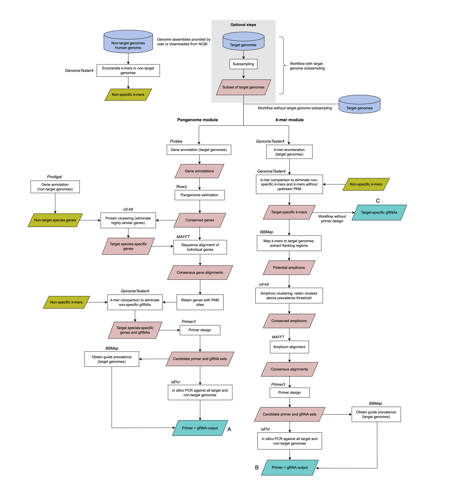

<!-- ABOUT THE PROJECT -->
<a name="readme-top"></a>
## About PathoGD

PathoGD is a bioinformatic pipeline for the rapid and high-throughput design of RPA primers and guide RNAs (gRNA) for CRISPR-Cas12a-based nucleic acid detection. It incorporates two complementary modules- pangenome and *k*-mer- targeting the protein-coding and whole genome, respectively, for selection of a target region and subsequent guide RNA and primer design. PathoGD was initially developed for and tested on bacterial genomes, but should work on any organism whose genome sequences are available. The default behavior is to design RPA primers for Cas12a-based detection, with the requirement of a TTTN PAM site directly upstream of the guide RNA sequence. However, there is also the option of PAM-less guide RNA design and primer design for PCR, rather than isothermal amplification.


## Introduction

The increasing availability of bacterial draft and whole-genome sequences provide an opportunity to identify alternative diagnostic markers from previously unexplored genomic regions. PathoGD was developed to facilitate the design of highly specific RPA primers and gRNAs for CRISPR-Cas12a-based pathogen detection. It provides a streamlined workflow to accelerate the *in silico* aspect of a CRISPR-Cas12a assay design. 

PathoGD incorporates multiple bioinformatics tools for performing the individual steps in the pipeline. It requires two databases- target and non-target- containing the genomes of the pathogen to be detected and closely-related organisms potentially resulting in cross-reactivity, respectively, for the selection of a highly-specific target region to be amplified. These genomes can either be automatically downloaded by PathoGD or provided by the user.

PathoGD will design guide RNAs that are specific to the target taxa, with at least 3 mismatches to non-target taxa and the human genome. The output file contains information which can be used for filtering to a smaller set of candidates for validation.


<p align="right">(<a href="#readme-top">back to top</a>)</p>

<a name="installation-top"></a>
## Installation

1. Make sure you have [Mamba](https://github.com/conda-forge/miniforge) installed

2. Clone the repo into your working directory
   ```sh
   git clone https://github.com/sjlow23/pathogd.git
   cd pathogd
   ```

3. Create pathogd conda environment
   ```sh
   mamba env create -n pathogdenv --file pathogd.yaml
   ```
   
4. Activate the conda environment
   ```sh
   mamba activate pathogdenv
   ```

5. Run install.sh script
   ```sh
   sh scripts/install.sh
   ```

6. You will also need Roary installed on your system and in your `PATH`, or if installed in a conda   environment, specify the environment name in the config file. 
   Roary is only needed if using the `pangenome` module (see below). See [Roary](https://github.com/sanger-pathogens/Roary "Roary") for more details.

   ```sh
   mamba create -n roary
   mamba activate roary
   mamba install -c bioconda roary
   mamba deactivate
   ```

<p align="right">(<a href="#installation-top">back to top</a>)</p>


<a name="modules-top"></a>
## Modules and workflows

Modules refer to the approach that is used for primer and gRNA design. The `-m` parameter is used for specifying which module is to be used. This parameter is mandatory only for workflows (see below) that require primer and gRNA design. Two modules are available in PathoGD:

1. `pangenome` - primers and gRNAs are designed from protein-coding regions only
2. `k-mer` - primers and gRNAs are designed from entire genome including non-coding regions

Workflows refer to the set of functions to be performed in the PathoGD pipeline. The `-w` parameter is used for specifying which workflow is to be used. This parameter is mandatory in the `pathogd` command. 


The following workflows perform specific functions only; no primer and gRNA design is executed:

1. `check` - check number of NCBI assemblies available for target and non-target taxa
2. `download_target` - only download NCBI target genome assemblies
3. `download_nontarget` - only download NCBI non-target genome assemblies


The following workflows are available for primer and gRNA design:

1. `ncbi_all_subsample` - download target and non-target genomes from NCBI; subsample target genomes
2. `ncbi_all_nosubsample` - download target and non-target genomes from NCBI; use all target genomes
3. `user_target_subsample` - user-provided target genomes; download non-target genomes from NCBI; subsample target genomes
4. `user_target_nosubsample` - user-provided target genomes; download non-target genomes from NCBI; use all target genomes
5. `user_all_subsample` - user-provided target and non-target genomes; subsample target genomes
6. `user_all_nosubsample` - user-provided target and non-target genomes; use all target genomes


#### Integrated tools

| **Software/Tool**                                                  | **Function**         | **Module**            |
|--------------------------------------------------------------------|----------------------|-----------------------|
| ncbi-genome-download                                               | Genome download      | pangenome and *k*-mer |
| Prodigal, Prokka                                                   | Gene annotation      | pangenome             |
| Roary                                                              | Pangenome estimation | pangenome             |
| genometester4                                                      | *k*-mer enumeration  | pangenome and *k*-mer |
| MAFFT, BBMap                                                       | Sequence alignment   | pangenome and *k*-mer |
| cd-hit                                                             | Sequence clustering  | pangenome and *k*-mer |
| Primer3                                                            | Primer design        | pangenome and *k*-mer |
| isPcr                                                              | *in silico* PCR      | pangenome and *k*-mer |
| bedtools, cdbtools, csvtk,   taxonkit, emboss, samtools, seqkit, R | Data processing      | pangenome and *k*-mer |


<p align="right">(<a href="#modules-top">back to top</a>)</p>


## Pipeline overview




<a name="config-top"></a>
## Configuration file

The configuration file is specified using the `-c` parameter in the `pathogd` command, and is mandatory for running PathoGD. This file is used for specifying most of the parameters and options for running the pipeline, including target and non-target organisms. A template of the file is provided (`config.txt`) above for `Mycoplasmoides genitalium`. 

Do not modify the file other than to include your specifications. Input your specifications after the `|` sign. The following table defines which fields need to be completed for running the PathoGD pipeline. Asterisks indicate fields that are optional, but would be good to include for logging purposes. These do not have to be accurate as they are not explicitly used for running the pipeline.


| **Parameter/Workflow** | **check** | **download_target** | **download_nontarget** | **ncbi_all_subsample**     | **ncbi_all_nosubsample**   | **user_target_subsample**  | **user_target_nosubsample** | **user_all_subsample**     | **user_all_nosubsample**   |
|------------------------|-----------|---------------------|------------------------|----------------------------|----------------------------|----------------------------|-----------------------------|----------------------------|----------------------------|
| db                     | no        | yes                 | yes                    | yes                        | yes                        | yes                        | yes                         | no                         | no                         |
| target                 | no        | yes                 | no*                    | yes                        | yes                        | no                         | no                          | no                         | no                         |
| target_taxid           | yes       | yes                 | no*                    | yes                        | yes                        | no                         | no                          | no                         | no                         |
| offtarget              | no        | no*                 | yes                    | yes                        | yes                        | yes                        | yes                         | no                         | no                         |
| offtarget_taxid        | yes       | no*                 | yes                    | yes                        | yes                        | yes                        | yes                         | no                         | no                         |
| domain                 | yes       | yes                 | yes                    | yes                        | yes                        | yes                        | yes                         | no                         | no                         |
| assembly_level         | no        | yes                 | yes                    | yes                        | yes                        | yes                        | yes                         | no                         | no                         |
| kmer                   | no        | no                  | no                     | yes                        | yes                        | yes                        | yes                         | yes                        | yes                        |
| threshold              | no        | no                  | no                     | yes                        | yes                        | yes                        | yes                         | yes                        | yes                        |
| mismatch               | no        | no                  | no                     | yes                        | yes                        | yes                        | yes                         | yes                        | yes                        |
| primer_design          | no        | no                  | no                     | yes                        | yes                        | yes                        | yes                         | yes                        | yes                        |
| ref_annot              | no        | no                  | no                     | yes                        | yes                        | yes                        | yes                         | yes                        | yes                        |
| subsample              | no        | no                  | no                     | yes                        | no                         | yes                        | no                          | yes                        | no                         |
| prokka_env             | no        | no                  | no                     | yes for 'pangenome' module | yes for 'pangenome' module | yes for 'pangenome' module | yes for 'pangenome' module  | yes for 'pangenome' module | yes for 'pangenome' module |
| roary_env              | no        | no                  | no                     | yes for 'pangenome' module | yes for 'pangenome' module | yes for 'pangenome' module | yes for 'pangenome' module  | yes for 'pangenome' module | yes for 'pangenome' module || no                       |


<p align="right">(<a href="#config-top">back to top</a>)</p>


<!-- USAGE EXAMPLES -->
<a name="usage-top"></a>
## Getting started

The command for running PathoGD is:

   ```sh
   pathogd [-c <config file>] [-p <cas (optional)>] [-a <amplification method (optional)] [-m <method (optional)>] [-w <workflow>] [-o <output directory>] [-r <reference genbank file (optional)>] [-t <number of cpus (default 8)>] 
   ```

To see all options, run `pathogd -h`. Some examples of usage are described below:

### A. Check number of available NCBI GenBank and RefSeq genome assemblies for taxon of interest using `check` workflow

Use this for determining the number of genomes available for your target and non-target taxa before running pipeline. This workflow only works if your target and non-target taxa consist of distinct species.

To use this workflow, you will need to identify the NCBI taxonomy identifiers for your target and non-target taxa. Follow the steps below to obtain the NCBI taxids.

If your target or non-target taxa is a single species:

   **a) Identify species taxid of target taxon (single species)**

   Go to [NCBI Taxonomy](https://www.ncbi.nlm.nih.gov/Taxonomy/Browser/wwwtax.cgi "Taxonomy"), and search for your species of interest by name. Clicking on the species name will take you to a new page with the Taxonomy ID.
   For example, the species taxid for *Mycoplasmoides genitalium* is **2097**.

If your target or non-target taxa includes multiple species, *eg.* all species belonging to a genus:

   **b) Identify all species taxids for a parent taxon comprising multiple species**
   
  Go to [NCBI Taxonomy](https://www.ncbi.nlm.nih.gov/Taxonomy/Browser/wwwtax.cgi "Taxonomy"), and search for your genus (or other taxonomic rank) of interest by name. Clicking on the genus name will take you to a new page with the Taxonomy ID.
  For example, the taxid for *Mycoplasmoides* is **2995234**. 

  Specifying just the parent taxid will be sufficient as the pipeline will search for all children taxa.

   **c) Input taxids in the appropriate fields in config file**

   **d) Run the following command:**

   ```sh
   pathogd -c config.txt -w check -o pathogd_output -t 8
   ```

   **Important notes:**

   1. If target is a single species, ensure that the taxid provided is for the 'species' rank. Some organisms may have been reported at a sub-species or strain level, in which case the taxid will be different from the species taxid.

   2. To obtain genomes at taxonomic ranks below species level, eg. sub-species or strain level, please download genomes manually. See [ncbi-genome-download](https://github.com/kblin/ncbi-genome-download "ncbi-genome-download") or [ncbi-datasets](https://www.ncbi.nlm.nih.gov/datasets/docs/v2/download-and-install/ "ncbi_datasets") for options to download genomes using NCBI taxids and/or taxon names. 

   3. If using the `check` workflow with species names, ensure that only one species is specified for the `target` and `offtarget` fields in `config.txt`.

   The outputs of the `check` workflow are:

   * Number of target and non-target genomes available (specified in log file)
   * Scripts for downloading target and non-target genomes for GenBank and/or RefSeq assemblies. Random subsampling is automatically performed to retain a maximum of 1000 and 100 genomes for each target and non-target species, respectively.


<p align="right">(<a href="#usage-top">back to top</a>)</p>


### B. Download genomes for target and/or non-target taxa of interest using the `download_target` or `download_nontarget` workflow

Use this to automatically download genome assemblies for target and/or non-target taxa by specifying their species names/taxids in the config file. Similar to the `check` workflow, this workflow only works if your target and non-target taxa consist of distinct species. Similar to the `check` workflow, you can specify an NCBI taxid at a higher taxonomic rank, and all children taxa will be downloaded.

   _Download target genomes_

   ```sh
   pathogd -c config.txt -w download_target -o pathogd_output -t 8
   ```

   _Download non-target genomes_

   ```sh
   pathogd -c config.txt -w download_nontarget -o pathogd_output -t 8
   ```

   **Important notes:**

   1. No subsampling is performed for both target and non-target taxa using this workflow. If specifying species with a large number of genome assemblies, *eg.* *Escherichia coli*, all genomes will be downloaded which may not be ideal if there is insufficient storage space.

   2. To prevent this, use the `check` workflow.

   3. If the taxid of a \"genus\" or higher taxonomic rank was specified for the non-target taxa in the config file (and target species is in same parent taxa), downloaded genomes will include target species. However, they will be identified and removed when the `ncbi_*` or `user_*` workflows are run.

   4. If both species name and species taxids are provided in the config file, only the **species taxids** will be used for downloading genome assemblies.


<p align="right">(<a href="#usage-top">back to top</a>)</p>


### C. Design primers and guide RNAs using any of the 6 `ncbi_*` or `user_*` workflows for primer and gRNA design

Examples using *Mycoplasmoides genitalium* for either pangenome or *k*-mer module:

   **a) Download target and non-target genome assemblies from NCBI, no subsampling of target genomes**

   Pangenome module:

   ```sh
   pathogd -c config.txt -m pangenome -w ncbi_all_nosubsample -o pathogd_output -t 16
   ```

   *k*-mer module:

   ```sh
   pathogd -c config.txt -m kmer -w ncbi_all_nosubsample -o pathogd_output -t 16
   ```

   The following examples are for the pangenome module. To use the *k*-mer module, replace `-m pangenome` with `-m kmer` in the commands below: 

   **b) Download genome assemblies from NCBI, subsample target genomes to total specified in config file**

   ```sh
   pathogd -c config.txt -m pangenome -w ncbi_all_subsample -o pathogd_output -t 16
   ```

The following examples are for cases where genomes are provided by the user.

To use these workflows, you must first create the output directory, *e.g.* `pathogd_output`, and the sub-directories `genomes_target` and `genomes_offtarget`.

Deposit your target and non-target genomes into their respective directories. The genome file names should have the following format: `"ABCDE_genomic.fna"` or `"ABCDE_genomic.fna.gz"`, where ABCDE is the unique name of the genome.

   **c) Provide own target and non-target genomes, no subsampling of target genomes**
   
   ```sh
   pathogd -c config.txt -m pangenome -w user_all_nosubsample -o pathogd_output -t 16
   ```


   **d) Provide own target genomes, download non-target genomes from NCBI, no subsampling of target genomes**
   
   ```sh
   pathogd -c config.txt -m pangenome -w user_target_nosubsample -o pathogd_output -t 16
   ```


   **Important notes:**

   1. If using the `ncbi_all_nosubsample` workflow, all target and non-target genomes will be downloaded which may not be ideal if the species is overrepresented, eg. *E. coli*. 

   2. To prevent this, use the `check` workflow, or provide own genomes.


<p align="right">(<a href="#usage-top">back to top</a>)</p>


## D. Design guide RNAs only using *k*-mer module

When using the *k*-mer module, the primer design step is optional. This results in a potentially larger pool of guide RNAs as the flanking sequences are not required to be conserved.
To exclude the primer design step, modify the config file so that the `primer_design` field is set to `no`.

The output file is `uniq_target_kmers_final_prevalence.tsv` under the `kmers_results` directory. It includes the following information:

| **Field**               | **Remarks**                                                     |
|-------------------------|-----------------------------------------------------------------|
| guide                   | Guide RNA id                                                    |
| actual_pam              | Protospacer adjacent motif (sequence upstream of gRNA)          |
| guide_sequence_to_order | Guide RNA sequence (5' --> 3')                                  |
| count_genomes_present   | Number of genomes with gRNA sequence                            |
| sum_across_genomes      | Total number of gRNA sequences across all target genomes        |
| avg_copy_number         | Average copy number of gRNA sequences across all target genomes |
| perc_total              | Percentage of genomes with gRNA sequence                        |


## E. Design guide RNAs for PAM-less Cas, eg. Cas13a applications

Although designed primarily for Cas12a applications, the guide RNAs designed can potentially be used for Cas13a-based diagnostics, if there is no PAM requirement for the gRNA to bind its target.
To design guide RNAs without the TTTN PAM restriction, add the **`-p`** flag:

   ```sh
   pathogd -c config.txt -m pangenome -p cas13 -w user_target_nosubsample -o pathogd_output -t 16
   ```


## F. Design primers for PCR applications

By default, PathoGD designs primers using parameters suited for RPA applications. 
To design primers for use with regular PCR, add the **`-a`** flag:

   ```sh
   pathogd -c config.txt -m pangenome -p cas13 -a pcr -w user_target_nosubsample -o pathogd_output -t 16
   ```
   


## Output

For the `ncbi_*` and `user_*` workflows with primer and gRNA design, the most relevant output is a tab-delimited file `pathogd_primers_stats.tsv` containing information on all the primers and gRNAs that were designed. The table below explains the contents of each field:

| **Field**                         | **Remarks**                                                                                                                                                                                                                                               |
|-----------------------------------|-----------------------------------------------------------------------------------------------------------------------------------------------------------------------------------------------------------------------------------------------------------|
| guide_set                         | Guide RNA id                                                                                                                                                                                                                                              |
| guide_seq                         | Guide RNA sequence (5' --> 3')                                                                                                                                                                                                                            |
| pam                               | Protospacer adjacent motif (sequence upstream of gRNA)                                                                                                                                                                                                    |
| gene                              | Gene id                                                                                                                                                                                                                                                   |
| gene_annotation                   | Gene name                                                                                                                                                                                                                                                 |
| primer_set                        | Primer set id for a given guide RNA id (maximum of 5 sets per gRNA; name   not unique)                                                                                                                                                                    |
| fwd_primer                        | Forward primer sequence (5' --> 3')                                                                                                                                                                                                                       |
| rev_primer                        | Reverse primer sequence (5' --> 3')                                                                                                                                                                                                                       |
| primer_cas13a_compatibility       | Compatibility of primers with Cas13a for RNA detection (if 'yes', can use   as is; if 'swap primers', swap forward and reverse primers). A T7 RNA   polymerase promoter sequence is prepended on the 5' end of the forward primer   for T7 transcription. |
| fwd_primer_length                 | Length of forward primer                                                                                                                                                                                                                                  |
| rev_primer_length                 | Length of reverse primer                                                                                                                                                                                                                                  |
| guide_length                      | Length of guide RNA                                                                                                                                                                                                                                       |
| fwd_primer_gc                     | Forward primer GC content                                                                                                                                                                                                                                 |
| rev_primer_gc                     | Reverse primer GC content                                                                                                                                                                                                                                 |
| guide_gc                          | Guide RNA GC content                                                                                                                                                                                                                                      |
| product_size                      | Amplicon size (based on consensus sequence)                                                                                                                                                                                                               |
| primerset_new                     | Unique primer set id (based on combination of primer and gRNA sequence;   should occur only once)                                                                                                                                                         |
| primerset_uniq                    | Primer set id (based on forward and reverse primer sequence; can occur   more than once if multiple gRNAs are compatible with the primer set)                                                                                                             |
| primer_target_prevalence_0mm      | Percentage of target genomes with perfect matches to primer sequence                                                                                                                                                                                      |
| primer_target_prevalence_2mm      | Percentage of target genomes with up to 2 mismatches to primer sequence                                                                                                                                                                                   |
| avg_amplicon_num_target           | Average number of amplicons in target genomes                                                                                                                                                                                                             |
| avg_amplicon_length_target        | Average amplicon size in target genomes                                                                                                                                                                                                                   |
| primer_nontarget_prevalence_0mm   | Percentage of non-target genomes with perfect matches to primer sequence                                                                                                                                                                                  |
| primer_nontarget_prevalence_2mm   | Percentage of non-target genomes with up to 2 mismatches to primer   sequence                                                                                                                                                                             |
| primer_nontarget_prevalence_8mm   | Percentage of non-target genomes with up to 8 mismatches to primer   sequence                                                                                                                                                                             |
| avg_amplicon_num_nontarget        | Average number of amplicons in non-target genomes                                                                                                                                                                                                         |
| avg_amplicon_length_nontarget     | Average amplicon size in non-target genomes                                                                                                                                                                                                               |
| guide_average_copy_number_target  | Average number of guide RNAs in target genomes                                                                                                                                                                                                            |
| guide_target_prevalence           | Percentage of target genomes with perfect matches to guide RNA sequence                                                                                                                                                                                   |
| guide_offtarget_prevalence_max5mm | Percentage of non-target genomes with 3≤n≤5 mismatches to guide RNA   sequence                                                                                                                                                                            |

<p align="right">(<a href="#readme-top">back to top</a>)</p>


## Checking sensitivity and specificity of user-provided primers and guide RNAs

A set of helper scripts included to validate a set of user-provided primers and guide RNAs.

Example use cases:
i) You have a set of primers and guide RNAs designed elsewhere and would like to estimate the prevalence of their binding sites across a set of target and non-target genomes.
ii) You would like to estimate the prevalence of binding sites of previously designed primers and guide RNAs from PathoGD across a newer database containing additional target and/or non-target genomes.

If primers and guide RNAs were designed elsewhere, you will need to provide a target and non-target genome database to run these scripts. See sections `A` and `B` above for examples on how to download these genomes.
The target and non-target genome directories should have the names `genomes_target` and `genomes_offtarget`, respectively.


1. Estimate primer prevalence across a set of target genomes and/or non-target genomes
   
   ```sh
   check_primers.sh -i primers.txt -d pathogd_output -o primer_prevalence.tsv
   ``` 

   `primers.txt` is a three-column tab-delimited file with the following information: unique primer id, forward primer sequence, reverse primer sequence. If filtering from `pathogd_primers_stats.tsv` output file, extract columns `primerset_new`, `fwd_primer`, and `rev_primer`.

   `pathogd_output` is the parent directory containing the target and non-target genome databases.


   To generate a FASTA file of amplicons in addition to primer prevalence output, use the `-a` flag.

   ```sh
   check_primers.sh -i primers.txt -d pathogd_output -o pathogd_primer_prevalence.tsv -a yes
   ``` 
   

   The output files will be in a directory called `primer_stats`.


2. Estimate guide prevalence across a set of target genomes and/or non-target genomes

   ```sh
   check_guides.sh -i guides.fasta -d pathogd_output -o pathogd_guide_prevalence.tsv
   ``` 

   The output files will be in a directory called `guide_stats`.


<p align="right">(<a href="#readme-top">back to top</a>)</p>


## Which module (pangenome or *k*-mer) should I use?

The module that you should use depends on your target organism and specific assay needs. Generally speaking, both modules should work well for bacterial genomes.
The pangenome module will generate primer and gRNA candidates that are in protein-coding regions, while the *k*-mer module additionally considers non-protein-coding regions.
The *k*-mer module has the advantage of identifying candidate gRNAs that are present in multiple copies across the genome, but do not necessarily have flanking regions that are conserved, so primers may not be able to be designed for these gRNAs.
However, they can still be useful for an assay not requiring a pre-amplification step.


## Citation

If you use this tool in your research, please cite:

    "PathoGD: an integrative genomics approach to primer and guide RNA design for CRISPR-based diagnostics"
    Soo Jen Low, Matthew O'Neill, William J. Kerry, Natasha Wild, Marcelina Krysiak, Yi Nong, Francesca Azzato, Eileen Hor, Lewis Williams, George Taiaroa, Eike Steinig, Shivani Pasricha, Deborah A. Williamson
    Commun Biol **8**, 147 (2025). https://doi.org/10.1038/s42003-025-07591-1
[PathoGD: an integrative genomics approach to primer and guide RNA design for CRISPR-based diagnostics](https://www.nature.com/articles/s42003-025-07591-1)
